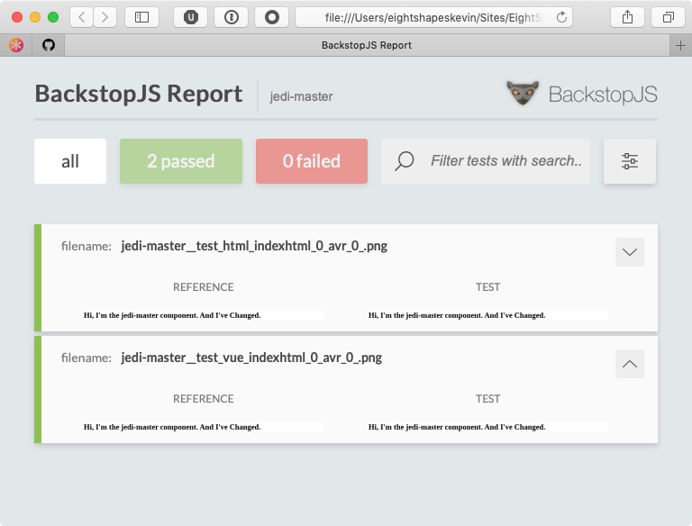

# ESDS Avr Generator
_Powered by [BackstopJS](https://garris.github.io/BackstopJS/)_

## Installation

Run the initializer:

```
npx @eightshapes/esds-avr-generator --init
```

This will:

1. Install `@eightshapes/esds-avr-generator` as a dev dependency in your project
* Allow you to configure your test file location and any CSS selectors you use to wrap your test screenshots
* Ask if you'd like to use Docker to run your tests (recommended)
* Add scripts to `package.json` that allow you to set up, run and approve tests 

## Usage
### Capture reference images
Before running tests for the first time, reference images must be captured that represent the "valid" state of your tests. To capture reference images run:

```
npm run avr-reference
```

After reference images have been captured subsequent tests can be run.

### Running tests
After making changes to the codebase that alter the visual output of your tests, run AVR to verify the changes are intentional and nothing unintentional has changed as a side effect.

```
npm run avr-test
```

After the tests have run the BackstopJS UI will be opened in the browser to display the test results:



### Approving changes
If tests fail during a test run, but the changes the failures represent are intentional, then approving those changes is the next step. To approve changes run:

```
npm run avr-approve
```

The most recent test images will be promoted to reference images and will be used on subsequent test runs.

## Advanced features
### Filtering
Limiting the number of AVR tests during a run is important as the test suite grows larger. Use the `--filter` flag to limit which tests are run. 

For example given the following test URLS:

* test/button.html
* test/card.html
* test/icon.html

To run only the tests for Button, run:

```
npm run avr-test -- --filter=button
```

Similarly to _approve_ new images only for Button, run:

```
npm run avr-approve -- --filter=button
```

### Backstop config
The initializer will configure your initial test options for you and create a `backstop.js` config file in the root of your project. If you need to add additional pages for testing, or you want to add other options, like testing across different viewports, refer to the [BackstopJS documentation](https://github.com/garris/BackstopJS#using-backstopjs)

### Running via Docker
To run tests across multiple host platforms, use Docker. This ensures a consistent, sandboxed environment for the tests to run, regardless of the host's platform. 

Be sure to first install Docker Desktop (Free) for your platform:

* [Docker Desktop for Mac](https://hub.docker.com/editions/community/docker-ce-desktop-mac)
* [Docker Desktop for Windows](https://docs.docker.com/docker-for-windows/install/)

Depending on the docker configuration specified during ESDS AVR installation, tests may already be configured to run via Docker by default. To determine if that's the case, refer to `backstop.js` in the root of your project.

Near the end should be a line that looks like:

```
module.exports = { ...localConfig, dockerDefault: true };
```

If `dockerDefault` is set to `true` then tests will always be run in a Docker container. To disable this functionality, set `dockerDefault` to `false`.

#### Running with Docker flag
When `dockerDefault` is set to `false`, tests can be conditionally run via Docker using the `--docker` flag. For example:

```
npm run avr-test
```

with `dockerDefault=false` will run the tests locally in the host environment.

```
npm run avr-test -- --docker
```

will run the tests in a Docker container.

This can be useful for debugging.

## How's it all work?
You want to know what's happening under the hood? It's fairly straightforward:

1. Before taking reference images or running tests, esds-avr spins up a local server using BrowserSync. This happens behind the scenes.
* ESDS AVR then passes the browser sync server config to backstop so the test URLs can be configured to point to the local server.
* Tests are run or reference images are captured
* After backstop has finished, the local server is shut down
* If tests were run, the default browser is launched showing the BackstopJS HTML report